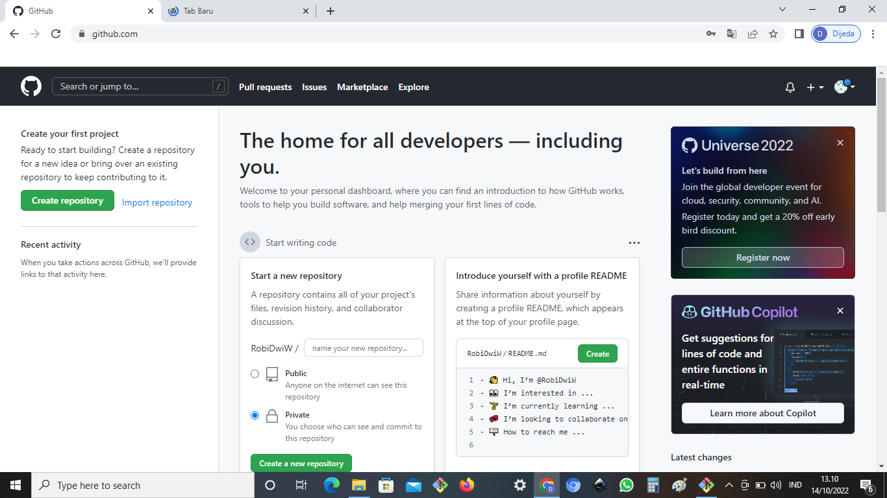

# CARA PENGGUNAAN GIT

## Instalasi GIT

#### - Download GIT, website resminya GIT (git-scm-com)
#### - Kemudian untuk git sesuai dengan arsitektur komputer kita. Kalau menggunakan 64bit, unduh yang 64bit. Begitu juga kalau menggunakan 32bit.
#### - Selamat, GIT  sudah terinstal di windows , untuk mencobanya, silahkan buka CMD atau PowerShell, kemudian ketik perintah
```
GIT --Version



#### - pada saat pertama kali menggunakan git, perlu dilakukan konfigurasi *user.name* dan *user.email*' 
#### - konfigurasi ini bisa dilakukan untuk global repository atau individual repository
#### - apabila belum dilakukan konfigurasi, akan mengakibatkan terjadi kegagalan saat menjalankan print global git commit


#### - config Global repository
```
$ gut config -- global user.name "name_user"
```
```
$ git config -- global user.email "name_user"
```

## perintah Dasar GIT


#### - git init, perintah untuk membuat repository local
#### - git add, perintah untuk menambahkan file baru, atau perubahan pada file pada staging sebelum proses commit.
#### - git commit, perintah untuk menyimpan perubahan kedalam database gi/t.
#### - git push -u origin master, perintah untuk mengirim perubahan pada repository local menuju server repository.
#### - git clone [url], perintah untuk membuat working directory yang diambil dari repositry sever.
#### - git remote add origin [url], perintah untuk menambahkan remote server/reopsitory server pada local repositry (working directory)
#### - git pull, perintah untuk mengambil/mendownload perubahan terbaru dari server repository ke local repository


#### -  Membuat Reposiory Local
#### - Buka direktory aktif, misal: d:\labs_pemrograman1 (buka menggunakan Windows Explorer)
#### - Buat direktory project praktikum pertama dengan nama latihan1 
```
#### - $ mkdir latihan1
```
#### - $ cd latihan1
```
#### - Sehingga terbentuk satu direktori baru dibawahnya, selanjutnya masuk kedalam direktori tersebut dengan perintah cd (change directory)
#### - direktory aktif menjadi: d:\labs_pemrograman1\latihan1
```
```
#### - Membuat Reposiory Local
``` 
#### - Jalankan perintah git init, untuk membuat repository local.
```
#### - $ git init
```
#### - Repository baru berhasil di inisialisasi, dengan terbentuknya satu direktori hidden dengan nama .git
#### - Pada direktori tersebut, semua perubahan pada working directory akan disimpan.


#### - Menambahkan File baru pada repository
```
```
#### - Untuk membuat file dapat menggunakan text editor, lalu menyimpan filenya pada direktori aktif (repository)
#### - disini kita akan coba buat satu file bernama README.md (text file)
```
#### - $ echo “# Latihan 1” >> README.md
```
#### - File README.md berhasil dibuat.
